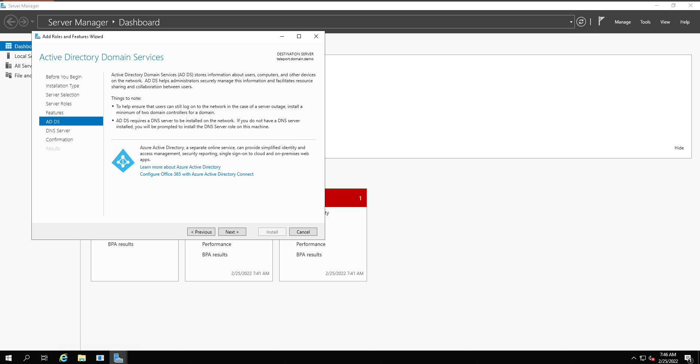
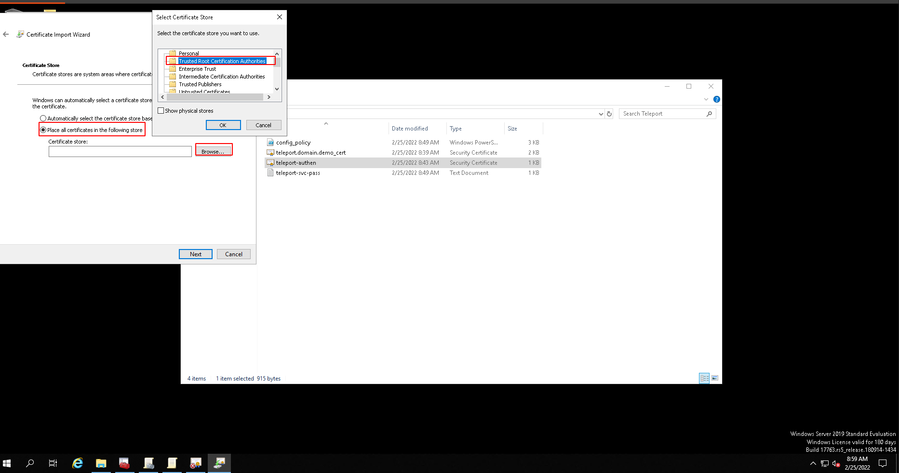
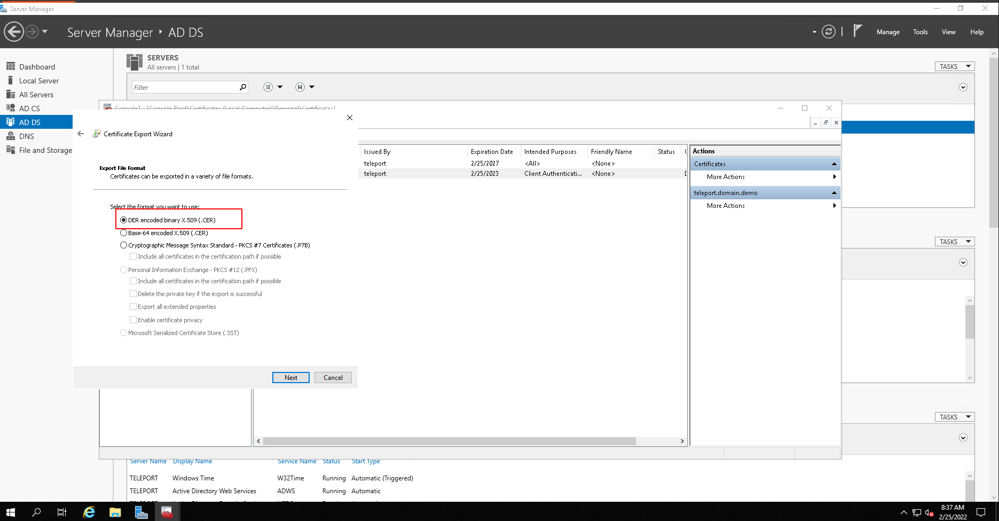
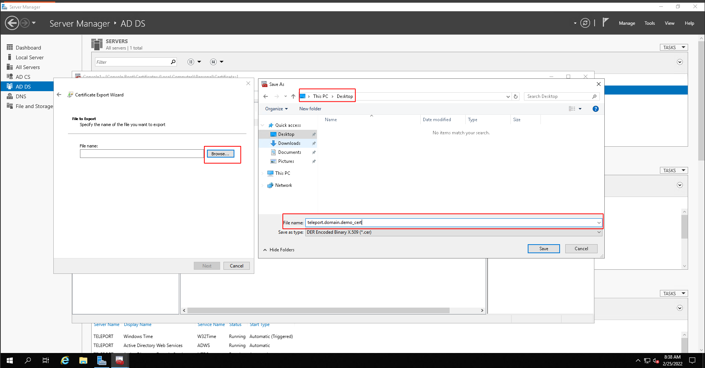

***Hướng dẫn cài đặt Teleport Access Desktop ***  
### Menu

[1. Chuẩn bị ](#1)  

[2. Cài đặt Teleport Access server](#2)
- [2.1  Cài đặt service teleport](#2.1)
- [2.2 Config Teleport Access server](#2.2)
- [2.3 Start and check status service teleport](#2.3)   

[3. Cài đặt AD & LDAPS server](#3)
- [3.1 Cài đặt AD](#3.1)
- [3.2 Cài đặt LDAPS](#3.2)
- [3.3 Start and check status service teleport](#3.3) 

[4. Import và Export certificate teleport access server và LDAPS server](#4)
- [4.1 Export teleport cert sau đó copy lên LDAPS server](#4.1)
- [4.2 Import cert teleport-authen.cer trên LDAPS server](#4.2)
- [4.3 Export cert LDAPS server sau đó copy lên server teleport access server](#4.3) 

[5. Config GPO trên LDAPS server và teleport access Desktop trên server teleport access server](#5)
- [5.1 Tạo file GPO_config.ps1](#5.1)
- [5.2 Config teleport access Desktop](#5.2)
- [5.3 Tạo các roles và user cho teleport](#5.3) 

### 1. Chuẩn bị 
### Chuẩn bị môi trường
-   Server linux(Ubuntu, Centos) cài đặt teleport server access: 
-   Windows server (2012 - 2019) cài đặt AD & LDAPS

### 2. Cài đặt Teleport Access server ( Ở đây tôi sử dụng Ubuntu 20.04, IP: 10.0.0.76 )

### 2.1 Cài đặt service teleport
    # Download Teleport's PGP public key
    sudo curl https://deb.releases.teleport.dev/teleport-pubkey.asc \
    -o /usr/share/keyrings/teleport-archive-keyring.asc
    # Add the Teleport APT repository
    cat<<EOF>/etc/apt/sources.list.d/teleport.list
    deb [signed-by=/usr/share/keyrings/teleport-archive-keyring.asc] https://deb.releases.teleport.dev/ stable main
    EOF
    sudo apt-get update
    sudo apt-get install teleport -y

### 2.2 Config Teleport Access server
vim /etc/teleport.yaml # Insert nội dung bên dưới

    version: v2
    teleport:
    nodename: Access node
    data_dir: /var/lib/teleport
    log:
        output: /var/log/teleport.log
        severity:
    ca_pin: sha256:df8dfceed44be73260d37736f9c0e5fedbd59c06b0d7b232ac9a76aeab17f45d
    auth_token: 7d8ae42392ae8b7503dd3b76ea76aca6960689b5157f8523

    auth_service:
    enabled: "yes"
    cluster_name: "teleport-cluster"
    listen_addr: 0.0.0.0:3025
    tokens:
    - proxy,node:7d8ae42392ae8b7503dd3b76ea76aca6960689b5157f8523
    authentication:
        type: local
        second_factor: otp

    ssh_service:
    enabled: "yes"
    labels:
        env: example
    commands:
    - name: hostname
        command: [hostname]
        period: 1m0s
    proxy_service:
    enabled: "yes"
    listen_addr: 127.0.0.1:3023
    web_listen_addr: 0.0.0.0:443
    tunnel_listen_addr: 127.0.0.1:3024
    public_addr: 10.0.0.76:443
    https_keypairs: []
    acme: {}

### 2.3 Start and check status service teleport
    systemctl start teleport
    systemclt enable teleport
    systemctl status teleport

### 3. Cài đặt AD & LDAPS server ( Ở đây tôi sử dụng Windows server 2019 , IP: 10.0.0.75 )

### 3.1 Cài đặt AD (Nếu bạn đã có AD thì có thê qua bước này)
  
  
 
 
 
 
 
 
 
 
 
 
 
 
 
 
 

### 3.1 Cài đặt AD (Nếu bạn đã có AD thì có thê qua bước này)

 
 
 
 
 
 
 
 
 
 
 
 

### 4. Import và Export certificate teleport access server và LDAPS server

### 4.1 Export teleport cert sau đó copy lên LDAPS server
    tctl auth export --type=windows > teleport-authen.cer

### 4.2 Import cert teleport-authen.cer trên LDAPS server

 
 
 
 

 
### 4.3 Export cert LDAPS server sau đó copy lên server teleport access server( Lưu tại thư mục /var/lib/teleport/teleport.domain.demo_cert.cer)

 
 
 
 
 
 
 
 
 

### 5. Config GPO trên LDAPS server và teleport access Desktop trên server teleport access server

### 5.1 Tạo file GPO_config.ps1 

    $Name="Teleport Service User"
    $SamAccountName="svc-teleport"
    $OutputFile="teleport-svc-pass.txt"

    # Generate a random password that meets the "Password must meet complexity requirements" security policy setting.
    # Note: if the minimum complexity requirements have been changed from the Windows default, this part of the script may need to be modified.
    Add-Type -AssemblyName 'System.Web'
    do {
    $Password=[System.Web.Security.Membership]::GeneratePassword(15,1)
    } until ($Password -match '\d')
    $SecureStringPassword=ConvertTo-SecureString $Password -AsPlainText -Force

    # Save the plaintext password to a file for later use in your teleport.yaml.
    $Password | Out-File $OutputFile

    New-ADUser `
    -Name $Name `
    -SamAccountName $SamAccountName `
    -AccountPassword $SecureStringPassword `
    -Enabled $true

    # Save your domain's distinguished name to a variable.
    $DomainDN=$((Get-ADDomain).DistinguishedName)

    # Create the CDP/Teleport container.
    # If the command fails with "New-ADObject : An attempt was made to add an object to the directory with a name that is already in use",
    # it means the object already exists and you can move on to the next step.
    New-ADObject -Name "Teleport" -Type "container" -Path "CN=CDP,CN=Public Key Services,CN=Services,CN=Configuration,$DomainDN"

    # Gives Teleport the ability to create LDAP containers in the CDP container.
    dsacls "CN=CDP,CN=Public Key Services,CN=Services,CN=Configuration,$DomainDN" /I:T /G "$($SamAccountName):CC;container;"
    # Gives Teleport the ability to create and delete cRLDistributionPoint objects in the CDP/Teleport container.
    dsacls "CN=Teleport,CN=CDP,CN=Public Key Services,CN=Services,CN=Configuration,$DomainDN" /I:T /G "$($SamAccountName):CCDC;cRLDistributionPoint;"
    # Gives Teleport the ability to write the certificateRevocationList property in the CDP/Teleport container.
    dsacls "CN=Teleport,CN=CDP,CN=Public Key Services,CN=Services,CN=Configuration,$DomainDN " /I:T /G "$($SamAccountName):WP;certificateRevocationList;"
    # Gives Teleport the ability to create and delete certificationAuthority objects in the NTAuthCertificates container.
    dsacls "CN=NTAuthCertificates,CN=Public Key Services,CN=Services,CN=Configuration,$DomainDN" /I:T /G "$($SamAccountName):CCDC;certificationAuthority;"
    # Gives Teleport the ability to write the cACertificate property in the NTAuthCertificates container.
    dsacls "CN=NTAuthCertificates,CN=Public Key Services,CN=Services,CN=Configuration,$DomainDN" /I:T /G "$($SamAccountName):WP;cACertificate;"

    $GPOName="Block teleport-svc Interactive Login"
    New-GPO -Name $GPOName | New-GPLink -Target $((Get-ADDomain).DistinguishedName)

    $GPOName="Teleport Access Policy"
    New-GPO -Name $GPOName | New-GPLink -Target $((Get-ADDomain).DistinguishedName)
    gpupdate /force

- Run file GPO_config.ps1 với Power shell với quyền Administrator
- Copy file: teleport-svc-pass.txt lên server teleport access sercer (Lưu tại thư mục: /var/lib/teleport/teleport-svc-pass.txt)

### 5.2 Config teleport access Desktop

- vim /etc/teleport.yaml # Insert thêm nội dung bên dưới

        windows_desktop_service:
        enabled: yes
        listen_addr: "0.0.0.0:3028"
        public_addr: "10.0.0.76:3028"
        ldap:
            addr: "teleport.domain.demo:636"
            domain: "domain.demo"
            username: 'svc-teleport@domain.demo'
            password_file: /var/lib/teleport/teleport-svc-pass.txt
            insecure_skip_verify: false
            der_ca_file: /var/lib/teleport/teleport.demo.cer
        discovery:
            base_dn: "CN=teleport,DC=demo"
        hosts:
            - "teleport.domain.demo"
            - "10.0.0.75"

- Thêm IP, domain name của LDAPS server vào file host teleport accees server

        echo "10.0.0.75 teleport.domain.demo " >> /etc/hosts

### 5.3 Tạo các roles và user cho teleport, tôi sử dụng các template bên dưới

- vim windows-desktop-admin.yaml

        kind: role
        version: v4
        metadata:
        name: windows-desktop-admins
        spec:
        allow:
            windows_desktop_labels:
            "*": "*"
            windows_desktop_logins: ["Administrator", "{{internal.windows_logins}}"]
- vim windows-user.yaml

        kind: role
        version: v4
        metadata:
        name: windows-desktop-users
        spec:
        allow:
            windows_desktop_labels:
            "*": "*"
            windows_desktop_logins: ["{{internal.windows_logins}}"]
- vim admin.yaml

        #
        # Example: Legacy Default Admin Role
        # Tip: For 6.0+ clusters, please use 'editor' for configuring Teleport
        #
        kind: role
        metadata:
        name: admin
        spec:
        allow:
            kubernetes_groups:
            - '{{internal.kubernetes_groups}}'
            windows_desktop_logins:
            - '{{internal.windows_logins}}'
            logins:
            - '{{internal.logins}}'
            - root
            node_labels:
            '*': '*'
            rules:
            - resources:
            - '*'
            verbs:
            - '*'
        deny:
            logins: null
        options:
            cert_format: standard
            enhanced_recording:
            - command
            - network
            forward_agent: true
            max_session_ttl: 30h0m0s
            port_forwarding: true
        version: v3
- vim user.yaml

        #
        # Example: Legacy Default Admin Role
        # Tip: For 6.0+ clusters, please use 'editor' for configuring Teleport
        #
        kind: role
        metadata:
        name: user
        spec:
        allow:
            kubernetes_groups:
            - '{{internal.kubernetes_groups}}'
            windows_desktop_logins:
            - '{{internal.windows_logins}}'
            logins:
            - '{{internal.logins}}'
            node_labels:
            '*': '*'
            rules:
            - resources:
            - role
            verbs:
            - list
            - read
            - resources:
            - session
            verbs:
            - list
            - read
            - resources:
            - trusted_cluster
            verbs:
            - connect
            - list
            - read
        deny:
            logins: null
        options:
            cert_format: standard
            enhanced_recording:
            - command
            - network
            forward_agent: true
            max_session_ttl: 30h0m0s
            port_forwarding: true
        version: v3

- Create roles và user 

        tctl create -f windows-desktop-admin.yaml
        tctl create -f windows-user.yaml
        tctl create -f admin.yaml
        tctl create -f user.yaml
- Restart and check status serivice teleport

        service teleport restart
        service teleport status

Vậy là đã xong, chúng ta cùng kiểm tra thành quả nào

 
 
 