### I. Giới thiệu và kiến trúc Teleport
### 1. Giới thiệu
-   Teleport là một proxy truy cập đa giao thức, nhận biết danh tính, có thể hiểu các giao thức: SSH, HTTPS, RDP, Kubernetes API, MySQL, MongoDB và PostgreSQL.
-   Dịch chuyển cho phép truy cập an toàn thuận tiện vào các tài nguyên sau NAT như:
    - SSH nodes 
    - Kubernetes clusters
    - PostgreSQL, MongoDB, CockroachDB and MySQL databases
    - Internal Web apps
    - Windows Hosts
    - Networked servers

### 2. Kiến trúc cơ bản
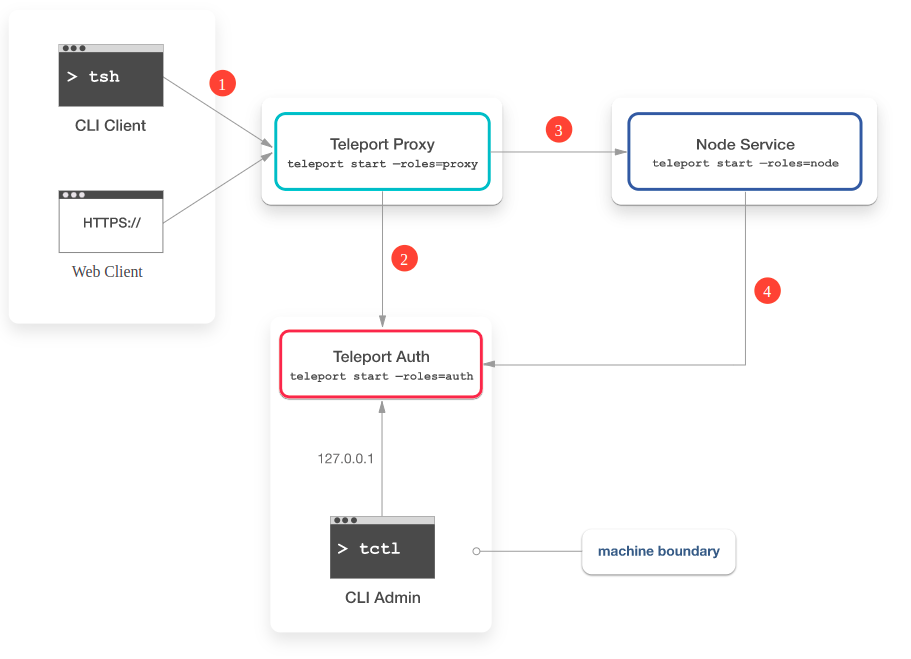  

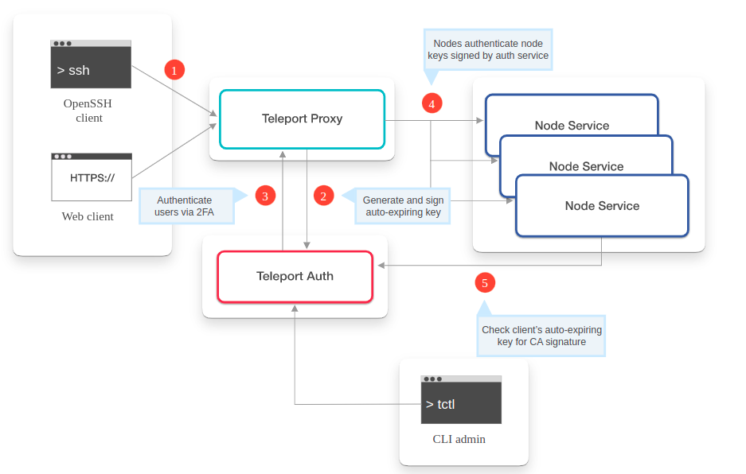  

### 1.1 Khởi tạo kết nối từ Client
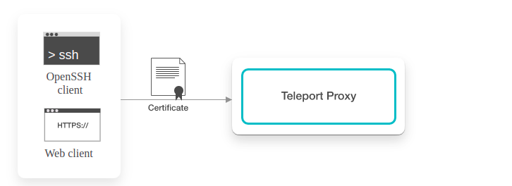  

- Client khởi tạo kết nối từ SSH tới proxy từ giao diện UI hoặc CLI. Khi thiết lập kết nối Client phải cung cấp certificate của nó. Client luôn luôn phải kết nối qua proxy với 2 lý do:
    -   Các node không phải lúc nào cũng có thể truy cập từ một network bên ngoài
    -   Proxy ghi lại các phiên SSH và theo dõi hoạt động của người dùng

### 2.2 Xác thực certificate của client
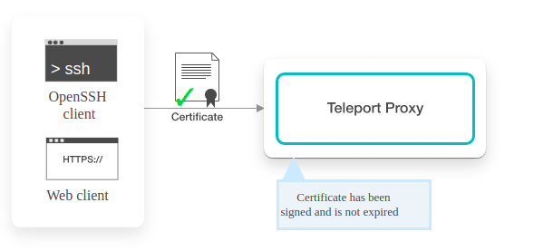  

- Proxy sẽ kiểm tra xem certificate đã gửi đã được máy chủ xác thực ký trước đó hay chưa

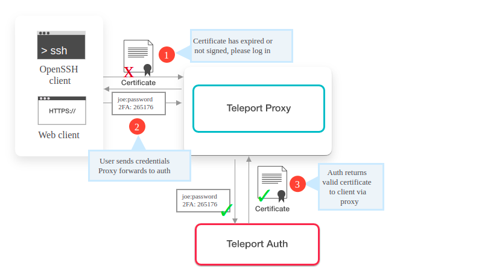

- Nếu không có certificate nào được cung cấp trước đó (đăng nhập lần đầu tiên) hoặc nếu certificate đã hết hạn, proxy sẽ từ chối kết nối và yêu cầu client đăng nhập tương tác bằng mật khẩu và yếu tố thứ hai nếu (OTP) được bật.
- Nếu thông tin xác thực là chính xác, máy chủ xác thực sẽ tạo và ký ccertificate mới và trả lại certificate đó cho client thông qua proxy.

### 2.3: Tra cứu Node
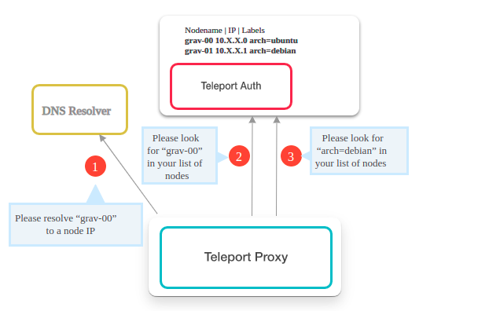

-   Ở bước này, proxy xác định vị trí node được yêu cầu trong một cụm. Có -3 cơ chế tra cứu mà proxy sử dụng để tìm địa chỉ IP của node:
    -   Sử dụng DNS để phân giải tên do Client yêu cầu.
    -   Hỏi Auth Server nếu có một Node được đăng ký với tên node request kết nối.
    -   Yêu cầu Auth Server  tìm một node (hoặc các nodes) có nhãn phù hợp với tên được yêu cầu.
-   Nếu node được định vị, proxy sẽ thiết lập kết nối giữa Client và node được yêu cầu. Sau đó, node đích bắt đầu ghi lại phiên, gửi lịch sử phiên đến máy chủ xác thực để được lưu trữ.

### 2.4 Xác thực certificate Node

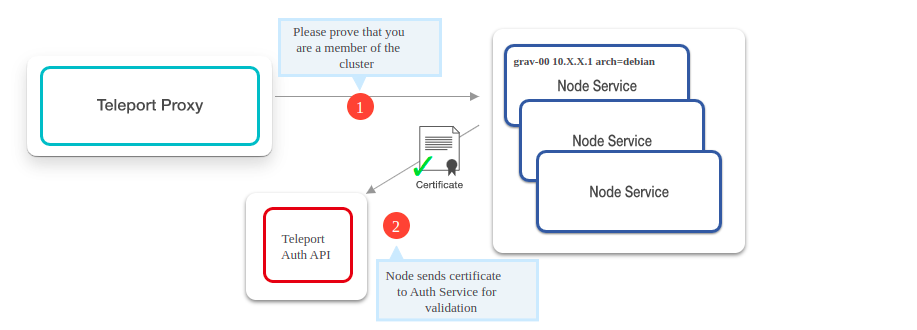

-   Khi node nhận được yêu cầu kết nối, nó sẽ kiểm tra với Auth Server để xác thực certificate của node và xác thực tư cách thành viên Cluster.
-   Nếu certificate node hợp lệ, node được phép truy cập Auth Server API cung cấp quyền truy cập vào thông tin về các node và người dùng trong Cluster.

### 2.5 Cấp quyền truy cập Node của user

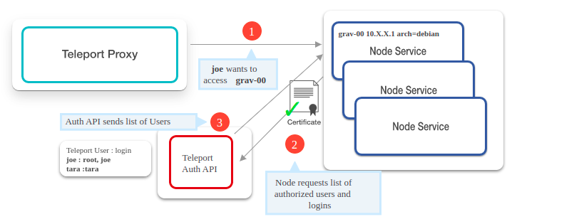

-   Node yêu cầu Auth Server cung cấp danh sách người dùng hệ điều hành (ánh xạ người dùng) cho Client kết nối, để đảm bảo Client được phép sử dụng thông tin đăng nhập hệ điều hành được yêu cầu.
-   Cuối cùng, Client được phép tạo kết nối SSH tới một node.

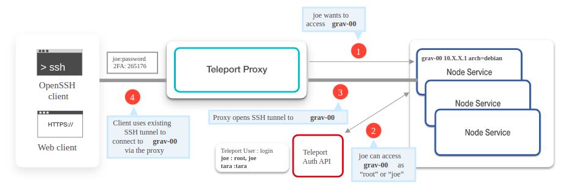

### II. Cài đặt Teleport 
### 2.1 Mô hình
-   Client network: 10.0.0.0/24
-   Auth server & proxy server network:
-   10.0.0.0/24
-   10.20.0.0/24
-   Node server network: 10.20.0.0/24
-   IP Planning
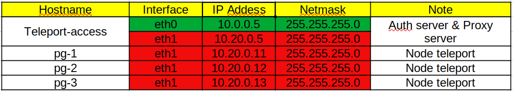

-  OS Cài đặt:
    -   Teleport-access (Ubuntu 20.04)
    -   Teleport-node   (Centos 7 hoặc Ubuntu 20.04)

### 2.1 Cài đặt Teleport Auth server và Proxy server
-   Thiết lập hostname và timezone:
    ```sh
    hostnamectl set-hostname teleport-access
    timedatectl set-timezone Asia/Ho_Chi_Minh
    ```
-   Download Teleport's PGP public key
    ```sh
    sudo curl https://deb.releases.teleport.dev/teleport-pubkey.asc \
    -o /usr/share/keyrings/teleport-archive-keyring.asc
    ```
-   Add the Teleport APT repository
    ```sh
    cat<<EOF>/etc/apt/sources.list.d/teleport.list
    deb [signed-by=/usr/share/keyrings/teleport-archive-keyring.asc] https://deb.releases.teleport.dev/ stable main
    EOF
    ```
- Update và Install Teleport package
    ```sh
    apt-get update
    apt-get install teleport -y
- Tạo file systemd teleport.service
    ```sh
    cat<<EOF>/lib/systemd/system/teleport.service
    [Unit]
    Description=Teleport SSH Service
    After=network.target

    [Service]
    Type=simple
    Restart=on-failure
    EnvironmentFile=-/etc/default/teleport
    ExecStart=/usr/local/bin/teleport start --pid-file=/run/teleport.pid --config=/etc/teleport.yaml
    ExecReload=/bin/kill -HUP $MAINPID
    PIDFile=/run/teleport.pid
    LimitNOFILE=8192

    [Install]
    WantedBy=multi-user.target
    EOF
    ```
- Reload daemon systemd
    ```sh
    systemctl daemon-reload
    ```
- Tạo file config teleport.yaml

    ```sh
    cat<<EOF>/etc/teleport.yaml
    version: v2
    teleport:
      nodename: teleport-access
      data_dir: /var/lib/teleport
      log:
    output: /var/log/teleport.log
    severity:
      ca_pin: 
      auth_token: 7d8ae42392ae8b7503dd3b76ea76aca6960689b5157f8523

    auth_service:
      enabled: "yes"
      cluster_name: "teleport-demo"
      listen_addr: 0.0.0.0:3025
      tokens:
      - proxy,node:78yto9pc7fvf71p0lo25c1s8st9jwh1vxgoh3uw6y0t5meqvh08j
      authentication:
        type: local
        second_factor: otp

    ssh_service:
      enabled: "yes"
      labels:
        env: example
        commands:
        - name: hostname
        command: [hostname]
        period: 1m0s

    proxy_service:
      enabled: "yes"
      listen_addr: 0.0.0.0:3023
      web_listen_addr: 10.0.0.5:3080
      tunnel_listen_addr: 0.0.0.0:3024
      public_addr: 10.0.0.5:3080
      https_keypairs: []
      acme: {}
    EOF
    ```
-   Restart service teleport
    ```sh
        service teleport restart
        service teleport status
        ● teleport.service - Teleport SSH Service
        Loaded: loaded (/lib/systemd/system/teleport.service; enabled; vendor preset: enabled)
        Active: active (running) since Thu 2022-03-17 21:50:32 +07; 2min 52s ago
        Main PID: 14004 (teleport)
        Tasks: 9 (limit: 2237)
        Memory: 34.7M
        CGroup: /system.slice/teleport.service
        └─14004 /usr/local/bin/teleport start --pid-file=/run/teleport.pid --config=/etc/teleport.yaml

        Mar 17 21:50:32 teleport-access systemd[1]: Started Teleport SSH Service.
        Mar 17 21:50:33 teleport-access teleport[14004]: [AUTH] Auth service 9.0.1:v9.0.1-0-g7bbe6f15c is starting on 10.0.0.5:3025.
        Mar 17 21:50:34 teleport-access teleport[14004]: [NODE] Service 9.0.1:v9.0.1-0-g7bbe6f15c is starting on 0.0.0.0:3022.
        Mar 17 21:50:34 teleport-access teleport[14004]: [PROXY]Reverse tunnel service 9.0.1:v9.0.1-0-g7bbe6f15c is starting on 0.0.0.0:3024.
        Mar 17 21:50:34 teleport-access teleport[14004]: [PROXY]Web proxy service 9.0.1:v9.0.1-0-g7bbe6f15c is starting on 10.0.0.5:3080.
        Mar 17 21:50:34 teleport-access teleport[14004]: [PROXY]SSH proxy service 9.0.1:v9.0.1-0-g7bbe6f15c is starting on 0.0.0.0:3023.

    ```
-   Check log teleport
    ```sh
        root@teleport-access:~# cat /var/log/teleport.log 
        2022-03-17T21:50:32+07:00 [AUTH]      INFO Updating cluster networking configuration: Kind:"cluster_networking_config" Version:"v22022-03-17T21:50:33+07:00 [PROC:1]    INFO Admin has obtained credentials to connect to the cluster. service/connect.go:416
        2022-03-17T21:50:33+07:00 [PROC:1]    INFO The process successfully wrote the credentials and state of Admin to the disk. service/connect.go:457
        2022-03-17T21:50:33+07:00 [PROC:1]    INFO Service auth is creating new listener on 0.0.0.0:3025. service/signals.go:213
        2022-03-17T21:50:33+07:00 [AUTH:1]    INFO Starting Auth service with PROXY protocol support. service/service.go:1341
        2022-03-17T21:50:33+07:00 [AUTH:1]    WARN Configuration setting auth_service/advertise_ip is not set. guessing 10.0.0.5:3025. service/service.go:1419
        2022-03-17T21:50:33+07:00     WARN No TLS Keys provided, using self-signed certificate. service/service.go:3885
        2022-03-17T21:50:33+07:00     WARN Generating self-signed key and cert to /var/lib/teleport/webproxy_key.pem /var/lib/teleport/webproxy_cert.pem. service/service.go:3903
        2022-03-17T21:50:33+07:00 [AUTH:1]    INFO Auth service 9.0.1:v9.0.1-0-g7bbe6f15c is starting on 10.0.0.5:3025. utils/cli.go:275
        2022-03-17T21:50:34+07:00 [PROC:1]    INFO Proxy has obtained credentials to connect to the cluster. service/connect.go:416
        2022-03-17T21:50:34+07:00 [PROC:1]    INFO The process successfully wrote the credentials and state of Proxy to the disk. service/connect.go:457
        2022-03-17T21:50:34+07:00 [PROC:1]    INFO Proxy: features loaded from auth server: Kubernetes:true App:true DB:true Desktop:true  service/connect.go:71
        2022-03-17T21:50:34+07:00 [PROC:1]    INFO Service proxy:ssh is creating new listener on 0.0.0.0:3023. service/signals.go:213
        2022-03-17T21:50:34+07:00 [PROC:1]    INFO Service proxy:web is creating new listener on 10.0.0.5:3080. service/signals.go:213
        2022-03-17T21:50:34+07:00 [PROC:1]    INFO Service proxy:tunnel is creating new listener on 0.0.0.0:3024. service/signals.go:213
        2022-03-17T21:50:34+07:00 [PROC:1]    INFO Node has obtained credentials to connect to the cluster. service/connect.go:416
        2022-03-17T21:50:34+07:00 [PROC:1]    INFO The process successfully wrote the credentials and state of Node to the disk. service/connect.go:457
        2022-03-17T21:50:34+07:00 [PROC:1]    INFO Node: features loaded from auth server: Kubernetes:true App:true DB:true Desktop:true  service/connect.go:71
        2022-03-17T21:50:34+07:00 [PROC:1]    INFO Service node is creating new listener on 0.0.0.0:3022. service/signals.go:213
        2022-03-17T21:50:34+07:00 [NODE:1]    INFO Service 9.0.1:v9.0.1-0-g7bbe6f15c is starting on 0.0.0.0:3022 sqlite cache will store frequently accessed items. service/service.go:1986
        2022-03-17T21:50:34+07:00 [NODE:1]    INFO Service 9.0.1:v9.0.1-0-g7bbe6f15c is starting on 0.0.0.0:3022. utils/cli.go:275
        2022-03-17T21:50:34+07:00     INFO Loading TLS certificate /var/lib/teleport/webproxy_cert.pem and key /var/lib/teleport/webproxy_key.pem. service/service.go:3368
        2022-03-17T21:50:34+07:00 [PROXY:SER] INFO Reverse tunnel service 9.0.1:v9.0.1-0-g7bbe6f15c is starting on 0.0.0.0:3024. utils/cli.go:275
        2022-03-17T21:50:34+07:00 [PROXY:SER] INFO Starting 9.0.1:v9.0.1-0-g7bbe6f15c on 0.0.0.0:3024 using sqlite cache will store frequently accessed items service/service.go:2870
        2022-03-17T21:50:34+07:00 [AUDIT:1]   INFO Creating directory /var/lib/teleport/log. service/service.go:2115
        2022-03-17T21:50:34+07:00 [AUDIT:1]   INFO Creating directory /var/lib/teleport/log/upload. service/service.go:2115
        2022-03-17T21:50:34+07:00 [AUDIT:1]   INFO Creating directory /var/lib/teleport/log/upload/sessions. service/service.go:2115
        2022-03-17T21:50:34+07:00 [AUDIT:1]   INFO Creating2022-03-17T21:50:34+07:00 [PROXY:AGE] INFO Starting reverse tunnel agent pool. service/service.go:3033
        2022-03-17T21:50:34+07:00 [PROXY:PRO] INFO Starting Kube proxy on . service/service.go:3092
        -03-17T21:50:34+07:00 [AUDIT:1]   INFO Creating directory /var/lib/teleport/log/upload. service/service.go:2115
        2022-03-17T21:50:34+07:00 [AUDIT:1]   INFO Creating directory /var/lib/teleport/log/upload/streaming. service/service.go:2115
        2022-03-17T21:50:34+07:00 [AUDIT:1]   INFO Creating directory /var/lib/teleport/log/upload/streaming/default. service/service.go:2115
        2022-03-17T21:50:34+07:00 [PROXY:SER] INFO Web proxy service 9.0.1:v9.0.1-0-g7bbe6f15c is starting on 10.0.0.5:3080. utils/cli.go:275
        2022-03-17T21:50:34+07:00 [PROXY:SER] INFO Web proxy service 9.0.1:v9.0.1-0-g7bbe6f15c is starting on 10.0.0.5:3080. service/service.go:2959
        2022-03-17T21:50:34+07:00 [PROXY:SER] INFO SSH proxy service 9.0.1:v9.0.1-0-g7bbe6f15c is starting on 0.0.0.0:3023. utils/cli.go:275
        2022-03-17T21:50:34+07:00 [PROXY:SER] INFO SSH proxy service 9.0.1:v9.0.1-0-g7bbe6f15c is starting on {0.0.0.0:3023 tcp } service/service.go:3000
        2022-03-17T21:50:34+07:00 [PROC:1]    INFO The new service has started successfully. Starting syncing rotation status with period 10m0s. service/connect.go:469
        2022-03-17T21:50:34+07:00 [DB:SERVIC] INFO Starting Postgres proxy server on 10.0.0.5:3080. service/service.go:3158
        2022-03-17T21:50:34+07:00 [DB:SERVIC] INFO Starting Database TLS proxy server on 10.0.0.5:3080. service/service.go:3176
        2022-03-17T21:50:34+07:00 [PROXY:SER] INFO Starting proxy gRPC server on 10.0.0.5:3080. service/service.go:3210
        2022-03-17T21:50:34+07:00 [PROXY:SER] INFO Starting TLS ALPN SNI proxy server on 10.0.0.5:3080. service/service.go:3239
        2022-03-17T21:50:36+07:00 [PROXY:1]   WARN Restart watch on error: empty proxy list. resource-kind:proxy services/watcher.go:218
        root@teleport-access:~# 
    ```
-   Check ca_pin Authen server
    ```sh
    root@teleport-access:~# tctl status
    Cluster  teleport-demo                                                           
    Version  9.0.1                                                                   
    Host CA  never updated                                                           
    User CA  never updated                                                           
    Jwt CA   never updated                                                           
    CA pin   sha256:965b9f078932778963dc58edec2d3d96f07d5337d3a1f97dcfedbdfa9449efc6
        ```
-   Create role admin
    ```sh
    cat<<EOF>admin.yaml
    #
    # Example: Legacy Default Admin Role
    # Tip: For 6.0+ clusters, please use 'editor' for configuring Teleport
    #
    kind: role
    metadata:
    name: admin
    spec:
    allow:
        kubernetes_groups:
        - '{{internal.kubernetes_groups}}'
        windows_desktop_logins:
        - '{{internal.windows_logins}}'
        logins:
        - '{{internal.logins}}'
        - root
        node_labels:
        '*': '*'
        rules:
        - resources:
        - '*'
        verbs:
        - '*'
    deny:
        logins: null
    options:
        cert_format: standard
        enhanced_recording:
        - command
        - network
        forward_agent: true
        max_session_ttl: 30h0m0s
        port_forwarding: true
    version: v3
    EOF
    tctl create -f admin.yaml
    ```
-   Create role user
    ```sh
    cat<<EOF>user.yaml
    #
    # Example: Legacy Default Admin Role
    # Tip: For 6.0+ clusters, please use 'editor' for configuring Teleport
    #
    kind: role
    metadata:
    name: user
    spec:
    allow:
        kubernetes_groups:
        - '{{internal.kubernetes_groups}}'
        windows_desktop_logins:
        - '{{internal.windows_logins}}'
        logins:
        - '{{internal.logins}}'
        node_labels:
        '*': '*'
        rules:
        - resources:
        - role
        verbs:
        - list
        - read
        - resources:
        - session
        verbs:
        - list
        - read
        - resources:
        - trusted_cluster
        verbs:
        - connect
        - list
        - read
    deny:
        logins: null
    options:
        cert_format: standard
        enhanced_recording:
        - command
        - network
        forward_agent: true
        max_session_ttl: 30h0m0s
        port_forwarding: true
    version: v3
    EOF
    tctl create -f user.yaml
    ```
-   Create user admin
    ```sh
    tctl users add admin --logins=root --roles=admin
    ```
    ```sh
    root@teleport-access:~# tctl users add admin --logins=root --roles=admin
    User "admin" has been created but requires a password. Share this URL with the user to complete user setup, link is valid for 1h:
    https://10.0.0.5:3080/web/invite/25962b5cc23c07921b87de99b766f888

    NOTE: Make sure 10.0.0.5:3080 points at a Teleport proxy which users can access.

    ```
-   Thiết lập password và OTP cho user bằng cách click vào url: https://10.0.0.5:3080/web/invite/25962b5cc23c07921b87de99b766f888

    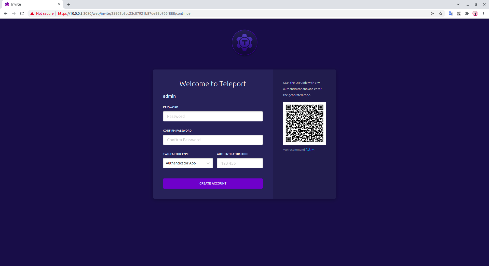
-   Kết quả đạt được
     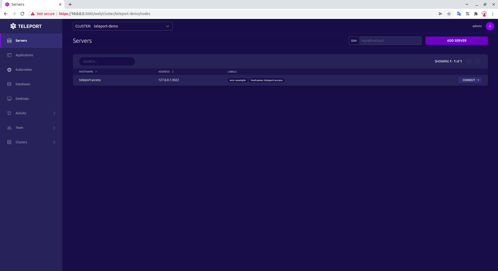    
-   Creater user sinhtv
    ```sh
    tctl users add admin --logins=sinhtv --roles=user
    ```
    ```sh
    root@teleport-access:~# tctl users add sinhtv --logins=sinhtv --roles=user
    User "sinhtv" has been created but requires a password. Share this URL with the user to complete user setup, link is valid for 1h:
    https://10.0.0.5:3080/web/invite/2f9013488d6e4d421ef8e83ed5c5bbdd

    NOTE: Make sure 10.0.0.5:3080 points at a Teleport proxy which users can access.
    root@teleport-access:~# 
    ```

### 2.2 Cài đăt teleport Node
-   Ubuntu OS:
    -   Download Teleport's PGP public key
        ```sh
        curl https://deb.releases.teleport.dev/teleport-pubkey.asc \
        -o /usr/share/keyrings/teleport-archive-keyring.asc
        ```
    -   Add the Teleport APT repository
        ```sh
        cat<<EOF>/etc/apt/sources.list.d/teleport.list
        deb [signed-by=/usr/share/keyrings/teleport-archive-keyring.asc] https://deb.releases.teleport.dev/ stable main
        EOF
        ```
    -   Update & Install teleport package
        ```sh
        apt-get update
        apt-get install teleport -y
        ```
-   Centos OS
    -   Cài đặt gói epel-release
        ```sh
        yum install epel-release -y
        ```
    -   Add teleport repo
        ```sh
        yum-config-manager --add-repo https://rpm.releases.teleport.dev/teleport.repo
        ```
    -   Install teleport package
        ```sh
        yum install teleport -y
        ```
- Tạo file systemd teleport.service
    ```sh
    cat<<EOF>/lib/systemd/system/teleport.service
    [Unit]
    Description=Teleport SSH Service
    After=network.target

    [Service]
    Type=simple
    Restart=on-failure
    EnvironmentFile=-/etc/default/teleport
    ExecStart=/usr/local/bin/teleport start --pid-file=/run/teleport.pid --config=/etc/teleport.yaml --roles=node
    ExecReload=/bin/kill -HUP $MAINPID
    PIDFile=/run/teleport.pid
    LimitNOFILE=8192

    [Install]
    WantedBy=multi-user.target
    EOF
    ```
- Reload daemon systemd
    ```sh
    systemctl daemon-reload
    ```
- Tạo file config teleport.yaml

    ```sh
    cat<<EOF>/etc/teleport.yaml
    teleport:
      nodename: pg-1 # Tnay đổi theo tên node
      data_dir: /var/lib/teleport
      ca_pin: "sha256:965b9f078932778963dc58edec2d3d96f07d5337d3a1f97dcfedbdfa9449efc6"
      auth_token: 78yto9pc7fvf71p0lo25c1s8st9jwh1vxgoh3uw6y0t5meqvh08j

      auth_servers: 
        - 10.20.0.5:3025

      log:
        output: /var/log/teleport.log
        severity:

    ssh_service:
        enabled: yes
        listen_addr: 10.20.0.11:3025 # Thay đổi theo IP node
        public_addr: 10.20.0.11:3025 # Thay đổi theo IP node
        labels:
            role: node
            type: teleport-client
        commands:
        - name: hostname
        command: [hostname]
        period: 1m0s

    EOF
    ```
-   Restart service teleport 
    ```sh
    service teleport restart
    service teleport status
    ```
    ```sh
    [root@localhost ~]# systemctl status teleport
    ● teleport.service - Teleport SSH Service
    Loaded: loaded (/usr/lib/systemd/system/teleport.service; disabled; vendor preset: disabled)
    Active: active (running) since Thu 2022-03-17 22:31:21 +07; 16min ago
    Main PID: 9720 (teleport)
    CGroup: /system.slice/teleport.service
            └─9720 /usr/local/bin/teleport start --pid-file=/run/teleport.pid --config=/etc/teleport.yaml --roles=node

    Mar 17 22:31:21 localhost.localdomain systemd[1]: Started Teleport SSH Service.
    Mar 17 22:31:21 localhost.localdomain teleport[9720]: [NODE]         Service 9.0.1:v9.0.1-0-g7bbe6f1 is starting on 10.20.0.11:3025.
    ```
### 2.3 Check trạng thái node trên server: Teleport-access
-   Server teleport-access
    ```sh
    tctl nodes ls
    ```
    ```sh
    root@teleport-access:~# tctl nodes ls
    Nodename        UUID                                 Address         Labels                                                        
    --------------- ------------------------------------ --------------- ------------------------------------------------------------- 
    teleport-access 5a82256c-016a-40b5-9ae5-48523c175d5e 127.0.0.1:3022  env=example,hostname=teleport-access                          
    pg-2            cb3029bb-5646-49ff-8ea4-1f4fb2b99d5f 10.20.0.12:3025 hostname=localhost.localdomain,role=node,type=teleport-client 
    pg-1            e4617292-77a8-4897-8cc3-6dce26dc201c 10.20.0.11:3025 hostname=localhost.localdomain,role=node,type=teleport-client 
    pg-3            f83c40e4-a31a-48ed-97cc-1e8b3a310e71 10.20.0.13:3025 hostname=localhost.localdomain,role=node,type=teleport-client 
    root@teleport-access:~# 

    ```
-   Web UI
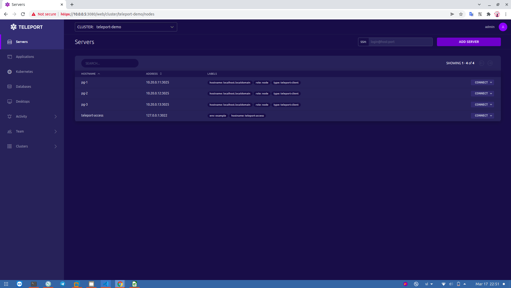      

### III. Teleport CLI command
### 3.1 Tsh command
-   Từ máy Client ssh vao Server trung gian có thể kết nối tới cụm Teleport Private
    ```sh
    ssh sinhtv@10.0.0.5 -p 2323
    ```
    ```sh
    sinhtv@HP-348-G7:~$ ssh sinhtv@10.0.0.5 -p 2323
    Welcome to Ubuntu 20.04.3 LTS (GNU/Linux 5.4.0-104-generic x86_64)

    * Documentation:  https://help.ubuntu.com
    * Management:     https://landscape.canonical.com
    * Support:        https://ubuntu.com/advantage

    This system has been minimized by removing packages and content that are
    not required on a system that users do not log into.

    To restore this content, you can run the 'unminimize' command.
    Last login: Thu Mar 17 23:00:16 2022 from 10.0.0.1
    sinhtv@fb1671b5c208:~$ 
    ```
- Tiến hành kiêm tra network tới các node bằng lênh
    ```sh
    sinhtv@fb1671b5c208:~$ ping 10.20.0.11 -c4
    PING 10.20.0.11 (10.20.0.11) 56(84) bytes of data.
    64 bytes from 10.20.0.11: icmp_seq=1 ttl=63 time=0.954 ms
    64 bytes from 10.20.0.11: icmp_seq=2 ttl=63 time=0.756 ms
    64 bytes from 10.20.0.11: icmp_seq=3 ttl=63 time=1.20 ms
    64 bytes from 10.20.0.11: icmp_seq=4 ttl=63 time=0.931 ms

    --- 10.20.0.11 ping statistics ---
    4 packets transmitted, 4 received, 0% packet loss, time 3005ms
    rtt min/avg/max/mdev = 0.756/0.959/1.196/0.156 ms
    sinhtv@fb1671b5c208:~$ 
    sinhtv@fb1671b5c208:~$ ping 10.20.0.12 -c4
    PING 10.20.0.12 (10.20.0.12) 56(84) bytes of data.
    64 bytes from 10.20.0.12: icmp_seq=1 ttl=63 time=0.718 ms
    64 bytes from 10.20.0.12: icmp_seq=2 ttl=63 time=1.08 ms
    64 bytes from 10.20.0.12: icmp_seq=3 ttl=63 time=0.825 ms
    64 bytes from 10.20.0.12: icmp_seq=4 ttl=63 time=0.794 ms

    --- 10.20.0.12 ping statistics ---
    4 packets transmitted, 4 received, 0% packet loss, time 3005ms
    rtt min/avg/max/mdev = 0.718/0.853/1.076/0.134 ms
    sinhtv@fb1671b5c208:~$ 
    sinhtv@fb1671b5c208:~$ ping 10.20.0.13 -c4
    PING 10.20.0.13 (10.20.0.13) 56(84) bytes of data.
    64 bytes from 10.20.0.13: icmp_seq=1 ttl=63 time=1.16 ms
    64 bytes from 10.20.0.13: icmp_seq=2 ttl=63 time=1.08 ms
    64 bytes from 10.20.0.13: icmp_seq=3 ttl=63 time=1.07 ms
    64 bytes from 10.20.0.13: icmp_seq=4 ttl=63 time=1.51 ms

    --- 10.20.0.13 ping statistics ---
    4 packets transmitted, 4 received, 0% packet loss, time 3005ms
    rtt min/avg/max/mdev = 1.065/1.200/1.506/0.179 ms
    sinhtv@fb1671b5c208:~$ 
    ```
-   Kết nối bằng openssh thông thường
    ```sh   
    sinhtv@fb1671b5c208:~$ ssh sinhtv@10.20.0.11
    The authenticity of host '10.20.0.11 (10.20.0.11)' can't be established.
    ECDSA key fingerprint is SHA256:X1E2gLp7/w529wczLAJi6PMsQ75xuNqpCPmQupCnyH4.
    Are you sure you want to continue connecting (yes/no/[fingerprint])? yes
    Warning: Permanently added '10.20.0.11' (ECDSA) to the list of known hosts.
    sinhtv@10.20.0.11's password: 
    ```
-   Login vào cluster
    ```sh
    tsh login --proxy=10.0.0.5:3080 --user=sinhtv --insecure
    ```
-   Nhập password & OTP user sinhtv sau đó kiểm tra trạng thái kết nối
    ```sh
    sinhtv@fb1671b5c208:~$ tsh login --proxy=10.0.0.5:3080 --user=sinhtv --insecure
    Enter password for Teleport user sinhtv:
    Enter your OTP token:
    613026
    WARNING: You are using insecure connection to SSH proxy https://10.0.0.5:3080
    > Profile URL:        https://10.0.0.5:3080
    Logged in as:       sinhtv
    Cluster:            teleport-demo
    Roles:              user
    Logins:             sinhtv
    Kubernetes:         enabled
    Valid until:        2022-03-18 11:11:43 +0700 +07 [valid for 12h0m0s]
    Extensions:         permit-agent-forwarding, permit-port-forwarding, permit-pty

    sinhtv@fb1671b5c208:~$ 
    ```
-   Liệt kê các node trong cluster
    ```sh
    sinhtv@fb1671b5c208:~$ tsh ls
    Node Name       Address         Labels                                                        
    --------------- --------------- ------------------------------------------------------------- 
    pg-1            10.20.0.11:3025 hostname=localhost.localdomain,role=node,type=teleport-client 
    pg-2            10.20.0.12:3025 hostname=localhost.localdomain,role=node,type=teleport-client 
    pg-3            10.20.0.13:3025 hostname=localhost.localdomain,role=node,type=teleport-client 
    teleport-access 127.0.0.1:3022  env=example,hostname=teleport-access                          
    sinhtv@fb1671b5c208:~$ 
    ```
-   Kết nối tới node trong list nodes bằng giao thức teleport ssh
    ```sh
    tsh ssh [USER]@[IP NODE] 
        hoặc
    tsh ssh [USER]@[HOSTNAME]
    ```
    ```sh
    sinhtv@fb1671b5c208:~$ tsh ssh 10.20.0.11
    [sinhtv@localhost ~]$ ip a
    1: lo: <LOOPBACK,UP,LOWER_UP> mtu 65536 qdisc noqueue state UNKNOWN group default qlen 1000
        link/loopback 00:00:00:00:00:00 brd 00:00:00:00:00:00
        inet 127.0.0.1/8 scope host lo
        valid_lft forever preferred_lft forever
        inet6 ::1/128 scope host 
        valid_lft forever preferred_lft forever
    2: ens33: <BROADCAST,MULTICAST,UP,LOWER_UP> mtu 1500 qdisc pfifo_fast state UP group default qlen 1000
        link/ether 00:0c:29:74:59:cc brd ff:ff:ff:ff:ff:ff
    3: ens34: <BROADCAST,MULTICAST,UP,LOWER_UP> mtu 1500 qdisc pfifo_fast state UP group default qlen 1000
        link/ether 00:0c:29:74:59:d6 brd ff:ff:ff:ff:ff:ff
        inet 10.20.0.11/24 brd 10.20.0.255 scope global noprefixroute ens34
        valid_lft forever preferred_lft forever
        inet6 fe80::69a4:4a4b:437f:9fad/64 scope link noprefixroute 
        valid_lft forever preferred_lft forever
    [sinhtv@localhost ~]$ 
    ```
    ```sh
    sinhtv@fb1671b5c208:~$ tsh ssh 10.20.0.12
    [sinhtv@localhost ~]$ ip a
    1: lo: <LOOPBACK,UP,LOWER_UP> mtu 65536 qdisc noqueue state UNKNOWN group default qlen 1000
        link/loopback 00:00:00:00:00:00 brd 00:00:00:00:00:00
        inet 127.0.0.1/8 scope host lo
        valid_lft forever preferred_lft forever
        inet6 ::1/128 scope host 
        valid_lft forever preferred_lft forever
    2: ens33: <BROADCAST,MULTICAST,UP,LOWER_UP> mtu 1500 qdisc pfifo_fast state UP group default qlen 1000
        link/ether 00:0c:29:7a:bb:5a brd ff:ff:ff:ff:ff:ff
    3: ens34: <BROADCAST,MULTICAST,UP,LOWER_UP> mtu 1500 qdisc pfifo_fast state UP group default qlen 1000
        link/ether 00:0c:29:7a:bb:64 brd ff:ff:ff:ff:ff:ff
        inet 10.20.0.12/24 brd 10.20.0.255 scope global noprefixroute ens34
        valid_lft forever preferred_lft forever
        inet6 fe80::69a4:4a4b:437f:9fad/64 scope link tentative noprefixroute dadfailed 
        valid_lft forever preferred_lft forever
        inet6 fe80::a43d:6adf:ea44:57/64 scope link noprefixroute 
        valid_lft forever preferred_lft forever
    [sinhtv@localhost ~]$ 
    ```
    ```sh
    sinhtv@fb1671b5c208:~$ tsh ssh 10.20.0.13
    [sinhtv@localhost ~]$ ip a
    1: lo: <LOOPBACK,UP,LOWER_UP> mtu 65536 qdisc noqueue state UNKNOWN group default qlen 1000
        link/loopback 00:00:00:00:00:00 brd 00:00:00:00:00:00
        inet 127.0.0.1/8 scope host lo
        valid_lft forever preferred_lft forever
        inet6 ::1/128 scope host 
        valid_lft forever preferred_lft forever
    2: ens33: <BROADCAST,MULTICAST,UP,LOWER_UP> mtu 1500 qdisc pfifo_fast state UP group default qlen 1000
        link/ether 00:0c:29:7b:55:71 brd ff:ff:ff:ff:ff:ff
    3: ens34: <BROADCAST,MULTICAST,UP,LOWER_UP> mtu 1500 qdisc pfifo_fast state UP group default qlen 1000
        link/ether 00:0c:29:7b:55:7b brd ff:ff:ff:ff:ff:ff
        inet 10.20.0.13/24 brd 10.20.0.255 scope global noprefixroute ens34
        valid_lft forever preferred_lft forever
        inet6 fe80::a43d:6adf:ea44:57/64 scope link tentative noprefixroute dadfailed 
        valid_lft forever preferred_lft forever
        inet6 fe80::69a4:4a4b:437f:9fad/64 scope link tentative noprefixroute dadfailed 
        valid_lft forever preferred_lft forever
        inet6 fe80::c163:4779:c750:b173/64 scope link noprefixroute 
        valid_lft forever preferred_lft forever
    [sinhtv@localhost ~]$ 
    ```


